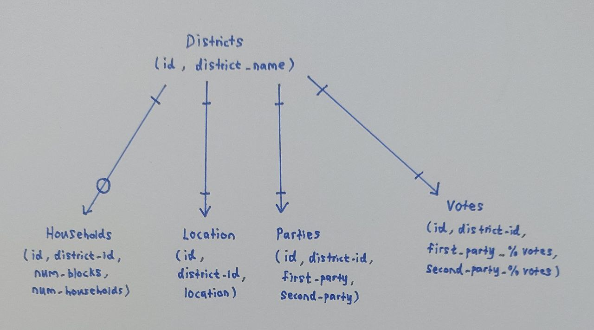

## Design Document

By Damaen Tan

Video overview: "https://youtu.be/VeO5ReU8SRs"

## Scope

The purpose of the project is to determine which party (first party - PAP, second party - opposition parties) has won
the fictitious 2024 election in Singapore using SQL with several own-made tables.

#### What the database contains:
    1. Districts - The different districts in Singapore
    2. Households - Information about the various household characteristics per district, such as the number of blocks in each district
       and the number of households in each district
    3. Location - The region (North, South, East, West, Central) each district is in
    4. Parties - Information containing the two parties that are involved in the election of each district
                 (NOTE: Some districts have three parties in real world, but this is simplified to two in this project)
    5. Votes - Information containing the percentage of votes for the first party, as well as the second party for each district

#### Other possible information out of scope of the database/analysis (due to too high complexity):
    1. Demographics - For instance the races, gender, religion, employment rates, retirees in each district
    2. Undisclosed Districts - Some districts in Singapore are left out as they are represented by single-member constituencies (SMC)
    3. Elections From Previous Years - Focus is only on 2024 election, only needed to explore trends which is out of scope for this project
    4. Time of Voting - Similar to 3, only needed for trends (such as decision for which party to vote during the day/night etc.)

## Functional Requirements

#### What should a user be able to do with your database?

    1. Identify the districts where the votes percentage is the most imbalanced (either favoring the ruling first party PAP or the
       opposition parties) and as such, the government from the losing party can try to take action to increase the number of votes
       for that district
    2. Identify the districts with the most balanced votes for each party so that the parties can try to sway the households to vote for
       them to win the subsequent election (easiest to win over)
    3. From the database, the user can choose/re-consider the district he/she wants to live in. For example, a user Hugo might want to
       live in a district that the opposition takes lead as he does not like how the PAP is running the country/district. From the data, Hugo can identify the districts where the second party votes percentage is higher than the first party (PAP) and choose these districts instead.

#### What's beyond the scope of what a user should be able to do with your database?

    1. Estimate the trends of each party's percentage of votes for several elections (2008, 2012, 2016, 2020, 2024) and make a prediction
       on whether the first party or the second party will win the next election in 2028. Again, this requires other datasets that are not considered in this project.
    2. There might be certain changes in district groupings in the 2028 election in future and from the 2024 data, a user might be able to
       approximate which party will more likely be winning the 2028 election. For instance Punggol East district in the 2020 election is split into Punggol West and Pasir Ris/Punggol districts in 2024.

## Representation

### Entities

#### 1st Table: `districts`

`id`: An integer that uniquely identifies each district. This is the primary key of the table.
`district_name`: A text field that holds the unique name of each district (e.g., "Aljunied," "Tampines"). It must be unique and cannot be null.

#### 2nd Table: `households`

`id`: An integer that uniquely identifies each entry in the households table. This is the primary key.
`district_id`: An integer that serves as a foreign key referencing the id column in the districts table, linking the household data to a specific district.
`num_blocks`: An integer representing the number of housing blocks in the district.
`num_households`: An integer representing the total number of households in the district.

#### 3rd Table: `location`

`id`: An integer that uniquely identifies each entry in the location table. This is the primary key.
`district_id`: An integer that serves as a foreign key referencing the id column in the districts table, linking the location to a specific district.
`location`: A text field indicating the geographical region of the district. Possible values are constrained to "North," "South," "East," "West," or "Central."

#### 4th Table: `parties`

`id`: An integer that uniquely identifies each entry in the parties table. This is the primary key.
`district_id`: An integer that serves as a foreign key referencing the id column in the districts table, linking the parties to a specific district.
`first_party`: A text field representing the name of the first political party contesting in the district.
`second_party`: A text field representing the name of the second political party contesting in the district.

#### 5th Table: `votes`

`id`: An integer that uniquely identifies each entry in the votes table. This is the primary key.
`district_id`: An integer that serves as a foreign key referencing the id column in the districts table, linking the voting data to a specific district.
`first_party_%votes`: A numeric field (percentage) indicating the percentage of votes received by the first party in the district. The value must be between 0 and 100.
`second_party_%votes`: A numeric field (percentage) indicating the percentage of votes received by the second party in the district. The value must be between 0 and 100.

#### Constraints:
Many of the columns of the table have the NOT NULL contraints, for instance there must be figures of district names, names of parties as well as party votes percentages in order for the proper analysis of the tables. Additionally, district name must be unique, there cannot be two districts that have the same name. As for the location, a CHECK is used as locations can only be classified into 5 categories - North, South, East, West and Central. Lastly, the first and second party votes percentage must lie from 0% to 100% and cannot have values such as -50% or 200%. Hence, I used BETWEEN 0 AND 100 as an added constraint for the first and second party votes percentages.

### Relationships

The below entity relationship diagram describes the relationships among the entities in the database.

## Optimizations

In this section you should answer the following questions:

Used several optimization via CREATE INDEX. This is because several of the columns will be heavily used for the analysis process, as well as multiple joins for most of the questions. For instance, there will be lots of grouping by districts or locations before aggregating the average/sum of votes percentages.

Indexes Used:
CREATE INDEX "district_name_index" ON "districts"("district_name");
CREATE INDEX "num_blocks_index" ON "households"("num_blocks");
CREATE INDEX "num_househlds_index" ON "households"("num_households");
CREATE INDEX "locations_index" ON "location"("location");
CREATE INDEX "first_party_index" ON "votes"("first_party_%votes");
CREATE INDEX "second_party_index" ON "votes"("second_party_%votes");

No particualar optimization is needed using CREATE VIEW in this project.

## Limitations

#### What are the limitations of your design?

1. Limited Representation of Multiple Parties
The current design only allows for two political parties (first_party and second_party) in each district. This does not account for scenarios where more than two parties contest in a district, limiting the model's ability to represent all competitors accurately.
Static Geographic Regions

2. Static Geographic Regions
The location table assumes each district belongs to one of five predefined regions ("North," "South," "East," "West," "Central"). If a district spans multiple regions or the geographical classifications change in the future, this design would not adapt well.
Household and Block Dynamics

3. Lack Of Household Dynamics
The households table only captures the current number of blocks and households. It does not allow for tracking changes over time, such as growth in the number of households or redevelopment projects.
Static Vote Percentages

4. Static Vote Percentages
The votes table captures only a single snapshot of voting percentages. It does not track historical election data or trends over time, which could limit analyses of voter behavior.

#### What might your database not be able to represent very well?

1. Time-Based or Historical Data
The design is static and does not handle historical data or changes effectively. For example, it cannot track changes in district boundaries, population growth, or evolving political affiliations over time.

2. Inter-District Relationships
The database does not represent relationships or dependencies between districts, such as shared resources, boundaries, or demographic similarities.

3. Complex Election Dynamics
The database cannot model complex election systems, such as multi-member constituencies or proportional representation, where vote allocation involves more than two parties or candidates.

4. Detailed Demographics
While the database captures basic household numbers, it lacks fields for detailed demographic data like age distribution, income levels, or ethnic composition, which are often important for deeper sociopolitical analysis.
